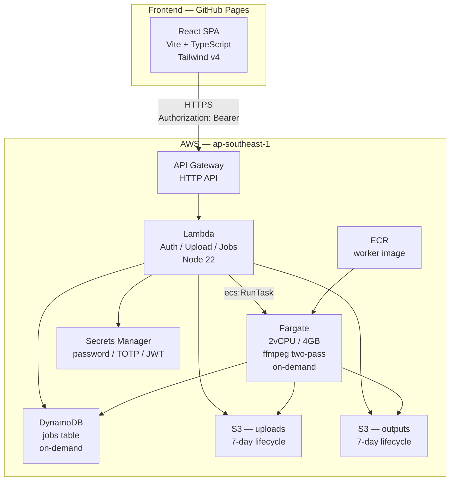
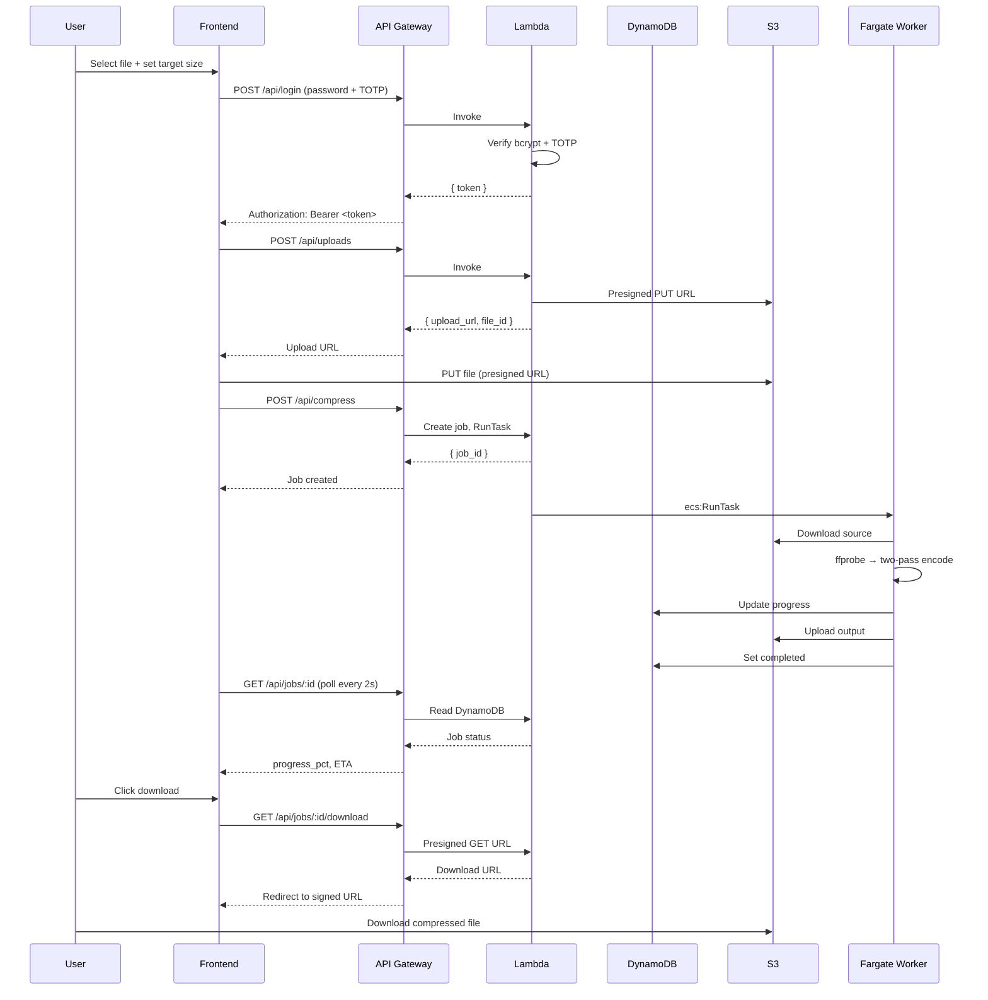

# KOMPRESSA

[](https://github.com/pjpangilinan/kompresa/actions/workflows/deploy.yml)
[](https://github.com/pjpangilinan/kompresa)
[](LICENSE)
[](https://react.dev)
[](https://vite.dev)
[](https://aws.amazon.com/cdk)

Video compression service. Upload a video, set a target size, gets compressed output. Single-admin, cost-aware, serverless AWS backend.

---

## Architecture



## Flow



## Stack

| Layer | Technology | Hosting |
|---|---|---|
| Frontend | Vite 8 · React 19 · TS 6 · Tailwind v4 | GitHub Pages |
| API | Lambda · Node 22 · bcryptjs · jsonwebtoken · speakeasy | AWS ap-southeast-1 |
| Compute | Fargate · 2vCPU / 4GB · ffmpeg two-pass | AWS ECS (on-demand) |
| Storage | S3 (uploads + outputs, 7-day lifecycle) | AWS |
| Database | DynamoDB (on-demand, TTL 7 days) | AWS |
| Secrets | AWS Secrets Manager (password hash, TOTP, JWT key) | AWS |
| Auth | Password + TOTP (no user accounts) | Application-level (Lambda) |

## Develop

```bash
npm install
npm run dev          # http://localhost:5173
```

**Dev credentials:** `passphrase=phantom`, `totp=000000` (shown in login UI).

## Scripts

| Command | What |
|---|---|
| `npm run dev` | Vite dev server with HMR |
| `npm run build` | TypeScript check + production build → `dist/` |
| `npm run preview` | Preview production build locally |
| `npm run lint` | oxlint (0 warnings required) |
| `npm test` | Vitest unit + component tests (40 tests) |
| `npm run test:watch` | Vitest watch mode |
| `npm run e2e` | Playwright e2e tests (6 tests) |

## Test Results

```
✓ 40 unit + component tests passed (vitest + RTL)
✓ 6 e2e tests passed (playwright — login, upload, status, download, redirect, a11y)
✓ 5 infra tests passed (CDK structure, resource declarations)
✓ 0 lint warnings (oxlint)
```

## Environment Variables

| Variable | Default | Required (prod) | Notes |
|---|---|---|---|
| `VITE_API_ORIGIN` | `""` (dev: mock) | Yes | Set via GitHub Variables (not Secrets) |
| `VITE_API_MOCK` | — | No | Removed; controlled by `import.meta.env.DEV` |

In development (`npm run dev`): mock backend handles all API calls.  
In production (`npm run build`): points to real AWS API.

## Project Layout

```
web/
  src/
    api/          # Typed API client + mock backend
    components/   # UI library (Button, Panel, FilePicker, JobCard, …)
    context/      # Auth + Jobs providers
    hooks/        # useAuth, useJobPolling, useJobsContext
    lib/          # Types, formatters, helpers
    pages/        # Login, Dashboard, JobStatus, Download
    index.css     # Tailwind v4 + design tokens
  infra/          # AWS CDK v2 (separate npm workspace)
    lib/          # CDK stack (30 AWS resources)
    lambda-code/  # Lambda handler (inline deploy package)
    worker/       # Docker image (Node + ffmpeg)
  e2e/            # Playwright tests
  public/         # Static assets
```

## Deploy

See `infra/README.md` for full AWS deployment guide.

**Quick reference:**

```bash
# 1. AWS infra
cd web/infra && npm install
cdk bootstrap aws://<account>/ap-southeast-1
cdk deploy

# 2. Push worker image
cd worker && docker build -t kompressa-worker .
docker tag kompressa-worker:latest <ecr-uri>:latest
docker push <ecr-uri>:latest

# 3. Set password
node -e "console.log(require('bcryptjs').hashSync('mypassword', 12))" | \
  aws secretsmanager put-secret-value --secret-id kompressa/password-hash --secret-string "$(cat)"

# 4. Frontend
npm run build
# Push to GitHub → GH Actions deploys to Pages
```

## Security

- Auth: bcrypt password + TOTP (HMAC-SHA256 JWT session)
- CORS: Lambda echoes `Origin` header (no preflight config)
- No cookies used cross-origin — `Authorization: Bearer` header
- S3: `blockPublicAccess: BLOCK_ALL`, `enforceSSL: true`
- DynamoDB: on-demand, TTL auto-cleanup (7 days)
- IAM: least-privilege per resource (Lambda, Fargate, S3, DynamoDB)
- Secrets: encrypted at rest (AWS managed KMS)
